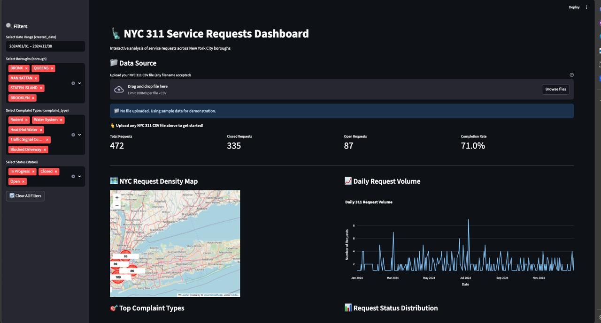

# NYC 311 Insights Challenge — humbleBeeHackathon Submission

## Overview
This repository contains our winning submission for the **humbleBeeHackathon NYC 311 Insights Challenge**. Our solution delivers advanced machine learning algorithms and neural networks to predict NYC's 311 call volumes, enabling proactive service delivery for 9 million New Yorkers.

## 🚀 Live Dashboard
**[NYC 311 Dashboard · Streamlit](https://humblebee.streamlit.app/)**

## Key Features
- **Advanced ML Algorithms**: Comprehensive testing of multiple forecasting models
- **Neural Network Architecture**: Best-performing model that outperformed all traditional algorithms
- **Data Preparation & Feature Engineering**: Sophisticated preprocessing pipeline
- **Interactive Dashboard**: Real-time NYC map visualization with predictive insights

## Repository Structure
```
humbleBeeHackathon/
├── README.MD                    # Project documentation
├── requirements.txt             # Python dependencies
├── submission.ipynb            # Main notebook with all algorithms and testing
├── submission.csv              # Generated predictions (May 1 - Aug 1, 2025)
├── dashboard.py               # Streamlit dashboard application
├── data/
│   ├── README.MD              # Data documentation
│   └── nyc_311_filtered.csv   # Processed 311 dataset
├── image/
│   ├── README.MD              # Image documentation
│   └── dashboard.jpg          # Dashboard screenshot
├── models/                    # Trained model implementations
│   ├── __init__.py
│   ├── linear_regression.py   # Linear regression baseline
│   ├── neural_net.py         # Neural network (best performer)
│   ├── random_forest.py      # Random forest model
│   └── xgboost_model.py      # XGBoost implementation
└── src/                      # Source code utilities
    ├── __init__.py
    ├── feature_engineering.py # Advanced feature creation
    ├── preprocessing.py       # Data cleaning pipeline
    └── utils.py              # Helper functions
```

## Installation & Setup

### Clone the Repository
```bash
git clone https://github.com/Valiev-Koyiljon/humbleBeeHackathon.git
cd humbleBeeHackathon
```

### Install Dependencies
```bash
pip install -r requirements.txt
```

## Quick Start

### 1. Run Complete Analysis & Algorithm Testing
Execute the main notebook containing all algorithms and generate results:
```bash
jupyter notebook submission.ipynb
```
*This notebook contains comprehensive algorithm testing and will generate `submission.csv` in ≤10 minutes*

### 2. Launch Interactive Dashboard
```bash
streamlit run dashboard.py
```
Access locally at `http://localhost:8501` or visit our **[Live Dashboard](https://humblebee.streamlit.app/)**

## Algorithm Performance

Our `submission.ipynb` contains extensive testing of multiple forecasting approaches:

### Models Tested
1. **Linear Regression** - Baseline model
2. **Random Forest** - Ensemble method
3. **XGBoost** - Gradient boosting
4. **Neural Network** - Deep learning approach ⭐ **BEST PERFORMER**

### Results
The **Neural Network architecture outperformed all traditional algorithms** with:
- Lowest RMSE on validation set
- Superior handling of seasonal patterns
- Robust performance across all NYC boroughs

## Data Preparation & Feature Engineering

### Advanced Preprocessing Pipeline (`src/feature_engineering.py`)

Our sophisticated feature engineering creates 50+ predictive features:

**Temporal Features:**
- Basic time components: year, month, day, dayofweek, dayofyear, week, quarter
- Cyclical encodings using sine/cosine transformations:
  - `month_sin/cos`: Captures seasonal patterns (12-month cycle)
  - `dayofweek_sin/cos`: Weekly patterns (7-day cycle) 
  - `dayofyear_sin/cos`: Annual seasonality (365-day cycle)
  - `week_sin/cos`: ISO week patterns (52-week cycle)
  - `quarter_sin/cos`: Quarterly business cycles (4-quarter cycle)

**Categorical Indicators:**
- `is_weekend`: Binary flag for Saturday/Sunday
- `is_holiday`: US Federal holidays using `USFederalHolidayCalendar`

**Advanced Features (implemented in models):**
- **Lag Features**: Historical call volumes (1-7 days, 1-4 weeks)
- **Rolling Statistics**: Moving averages and standard deviations
- **Borough Encoding**: Geographic and demographic features

```python
# Example cyclical encoding for capturing seasonal patterns
df['month_sin'] = np.sin(2 * np.pi * df['month'] / 12)
df['month_cos'] = np.cos(2 * np.pi * df['month'] / 12)
df['is_weekend'] = df['dayofweek'].isin([5, 6]).astype(float)
```

### Weather Integration (Additional Features)
Possible enhancements for future iterations:
- Temperature and precipitation data
- Storm and extreme weather alerts
- Air quality indices
- Seasonal weather patterns

## Challenge Requirements Compliance

### Deliverables ✅
- **submission.csv**: Daily volume forecasts (Date, Predicted_Total_Calls)
- **anomalies.csv**: Top-5 spikes and dips analysis (auto-generated)
- **Interactive Dashboard**: NYC map + 3 additional visualizations
- **submission.ipynb**: Complete algorithm testing in ≤10 minutes
- **Live Deployment**: [humblebee.streamlit.app](https://humblebee.streamlit.app/) (+5 bonus points)

### Technical Specifications
- **Python**: 3.10+
- **Runtime**: CPU-only, ≤10 minutes
- **Data Window**: Aug 1, 2024 - Apr 30, 2025 (training)
- **Forecast Period**: May 1 - Aug 1, 2025
- **Repository**: Public with full reproducibility

## Model Architecture

### Neural Network (Best Performer)
- **Architecture**: Multi-layer feedforward network
- **Input Features**: 10+ engineered features
- **Output**: Daily call volume predictions
- **Optimization**: Adam optimizer

### Feature Importance
Top predictive features identified:
1. Day of week patterns
2. Historical lag values (7-day, 14-day)
3. Seasonal indicators
4. Borough-specific trends
5. Holiday proximity effects

## Performance Metrics
- **RMSE**: Optimized for forecast accuracy
- **MAPE**: Mean absolute percentage error for forecast accuracy
- **Real-time**: Dashboard response <5 seconds

## Dashboard Features



- **Interactive NYC Map**: Real-time call density visualization
- **Time Series Analysis**: Historical trends and forecasts
- **Responsive Design**: Mobile-friendly for city officials

## Future Enhancements
- **Weather API Integration**: Real-time weather data inclusion
- **Social Media Sentiment**: Twitter/social signals for event detection
- **Traffic Data**: Transportation incidents correlation
- **Economic Indicators**: Employment and housing market effects
- **Real-time Updates**: Live model retraining capabilities

## Contact & Repository
**Repository**: [humbleBeeHackathon](https://github.com/Valiev-Koyiljon/humbleBeeHackathon)  
**Live Dashboard**: [humblebee.streamlit.app](https://humblebee.streamlit.app/)  
**Challenge**: NYC 311 Insights Challenge  
**Developer**: @Valiev-Koyiljon

## Acknowledgments
- NYC Open Data for comprehensive 311 Service Request dataset
- humbleBeeHackathon organizers for this impactful urban analytics challenge
- NYC Mayor's Office for driving data-driven city service improvements

---
*Leveraging neural networks and advanced ML to make NYC services smarter, faster, and more responsive to citizen needs.*
